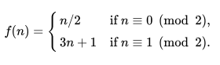

## Zadanie
1. Stwórz bibliotekę w języku C wystawiającą klientom następujące dwie funkcje:
    - `int collatz_conjecture(int input)` - funkcja realizująca regułę Collatza postaci:

        

    Funkcja ta przyjmuje jedną liczbę typu całkowitego. Jeżeli jest ona parzysta, podziel ją przez 2 i zwróć wynik. Jeżeli jest nieparzysta, pomnóż ją przez 3 i dodaj 1, a następnie zwróć wynik.
    - `int test_collatz_convergence(int input, int max_iter)` - funkcja sprawdzająca po ilu wywołaniach collatz_conjecture zbiega się do 1. Powinna ona wywoływać regułę Collatza najpierw na liczbie wejściowej a później na wyniku otrzymanym z reguły. W celu ochrony przed zbyt długim zapętlaniem się funkcji drugi parametr stanowi górną granicę liczby iteracji. W przypadku gdy funkcja wykona maksymalną ilość iteracji i nie znajdzie wyniku 1, wtedy zwróć -1.
2. W pliku makefile utwórz dwa wpisy: do kompilacji statycznej biblioteki i do kompilacji współdzielonej.
3. Napisz klienta korzystającego z kodu biblioteki, klient powinien sprawdzać kilka liczb, wykorzystując test_collatz_convergence, tj. po ilu iteracjach wynik zbiegnie się do 1 i wypisać liczbę iteracji na standardowe wyjście. Klient powinien korzystać z biblioteki na 3 sposoby:
    - Jako biblioteka statyczna
    - Jako biblioteka współdzielona (linkowana dynamicznie)
    - Jako biblioteka ładowana dynamicznie
    Dla każdego z wariantów utwórz odpowiedni wpis w Makefile. Do realizacji biblioteki dynamicznej użyj definicji stałej (-D) i dyrektywy preprocesora, aby zmodyfikować sposób działania klienta.
4. Wyświetl zawartość plików binarnych wszystkich wariantów klienta przy pomocy programu objdump, znajdź miejsca wywołania funkcji `test_collatz_convergence` omów różnice w kodzie binarnym. Dla większej jasności kodu kompiluj bez optymalizacji -O0.